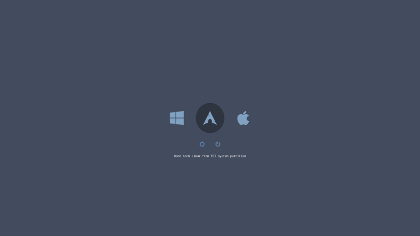

# rEFInd theme Nord
[](https://github.com/jaltuna/refind-theme-nord/actions/workflows/test.yml)
[](https://github.com/jaltuna/refind-theme-nord/blob/main/LICENSE.md)

Simple [rEFInd](http://www.rodsbooks.com/refind/) theme inspired to the [Nord](https://www.nordtheme.com/) palette.



This theme is derived from icons from other source; see [COPYING](https://github.com/jaltuna/refind-theme-nord/blob/main/COPYING) for details.
 
## Installation

* On UNIX-like platforms

Simply open a terminal and enter:

```bash
sudo bash -c "$(curl -sSL https://raw.githubusercontent.com/jaltuna/refind-theme-nord/main/install.sh)"
```

### TODO

* Add icons for other distros
* Add [Snow Storn](https://www.nordtheme.com/docs/colors-and-palettes) palette

