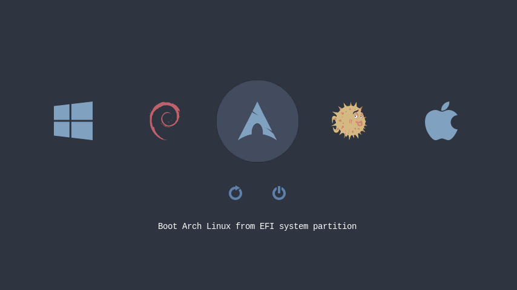

# rEFInd theme Nord
[](https://github.com/jaltuna/refind-theme-nord/actions/workflows/test.yml)
[](https://github.com/jaltuna/refind-theme-nord/blob/main/LICENSE) [](https://aur.archlinux.org/packages/refind-theme-nord/)

Simple [rEFInd](http://www.rodsbooks.com/refind/) theme inspired by the [Nord](https://www.nordtheme.com/) palette.



This theme is derived from icons from other source; see [COPYING](https://github.com/jaltuna/refind-theme-nord/blob/main/COPYING) for details.
 
## Installation

On UNIX-like platforms simply open a terminal and enter:

```bash
curl -sL https://git.io/refind-theme-nord | bash
```


Or if you prefer to install manually:

1. Download lastest release
   ```bash
   curl -sL https://github.com/jaltuna/refind-theme-nord/releases/download/1.0.0/refind-theme-nord-1.0.0.tar.gz | tar xvz
   ```
   ```bash
   cd refind-theme-nord-1.0.0
   ```
2. Identify your `EFI` partition and inside it your `refind` directory. For example: `/efi/EFI/refind`
   ```bash
   tree -L 3 /efi   
   ```
   It results in:
   ```bash
   /efi
   └── EFI
       └── refind
           ├── fonts             
           ├── icons        
           ├── refind.conf
           ├── refind_x64.efi        
           └── vars
   ```
  
3. Create the directory `/efi/EFI/refind/themes/nord` and copy files to it. You need root permissions
   ```bash
   sudo mkdir -p /efi/EFI/refind/themes/nord
   ```

   ```bash
   sudo cp -r {icons,theme.conf,*.png} $_      
   ```

4. Includes Nord theme in `/efi/EFI/refind/refind.conf`
   ```bash
   sudo sed "s/^include/#include/g" -i /efi/EFI/refind/refind.conf
   ```

   ```bash
   echo "include themes/nord/theme.conf" | sudo tee -a /efi/EFI/refind/refind.conf
   ```

## Installation on Arch Linux

From AUR repository:
```bash
git clone https://aur.archlinux.org/refind-theme-nord.git
cd refind-theme-nord
makepkg -si
```

Using AUR helper as PARU:
```bash
paru -S refind-theme-nord
```

### TODO

- [x] Add icons for other distros
- [ ] Add [Snow Storn](https://www.nordtheme.com/docs/colors-and-palettes) palette
